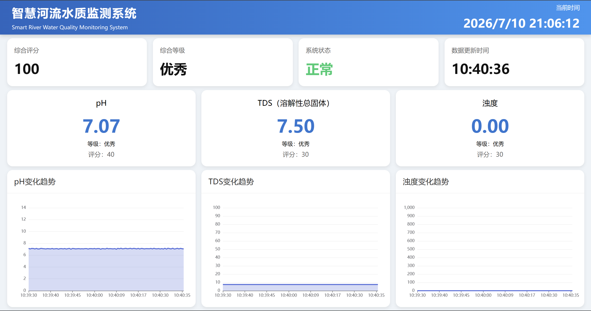

# 参赛作品 - 智慧河流水质监测系统

> 基于 **STM32 + ESP8266 + IoT + AI** 的智慧河流水质监测系统，实现河流水质实时采集、无线传输、云端分析与可视化监控。
## 项目简介

随着工业发展、城市建设以及极端天气事件（暴雨、洪水、泥石流等）的增加，河流水质容易受到污染，传统人工巡检方式存在效率低、实时性差等问题。

本项目设计了一套基于 **物联网（IoT）** 与 **人工智能（AI）** 的智慧河流水质监测系统，通过多种传感器实时采集河流水质数据，经 ESP8266 上传至云平台，实现：

- 水质实时监测
- 云端数据存储
- 数据可视化
- 水质等级判断

### 技术栈
- 嵌入式：STM32F103C8T6 (HAL 库) + ESP8266 (Arduino IDE)
- 网站: React + TypeScript + Vite + Mantine UI + ECharts
- API服务器: Python + FastAPI

---
# 项目背景

近年来，工业废水排放、城市建设以及自然灾害等因素，使河流水环境受到越来越大的影响。

例如：

- 暴雨
- 山洪
- 泥石流
- 洪水

都会导致大量泥沙、垃圾、污染物进入河流，使：

- pH 发生变化
- 浊度急剧升高
- TDS 增加
- 水质恶化

如果仍采用传统人工巡检方式，往往无法第一时间发现异常。

随着物联网、无线通信和人工智能的发展，可以利用智能设备实现全天候连续监测，大幅提升监测效率，为环保、水利及应急部门提供可靠的数据支持。

---
## 项目结构

点击链接跳转到对应目录：

[api-server](/api-server/) - API 服务器

[d1mini](/d1mini/) - ESP8266程序 (Arduino IDE)

[pcb](/pcb/) - 嘉立创PCB设计文件

[stm32f103c8t6](/stm32f103c8t6/) - STM32程序 (STM32CubeIDE + STM32CubeMX + HAL 库)

[tools](/tools/) - 工具脚本

[water-admin](/water-admin/) - 前端管理平台 (React + TypeScript + Vite + Mantine UI + ECharts)

---

# 项目目标

本项目旨在实现一套低成本、高可靠性的智慧河流水质监测系统，实现：

- 河流水质实时监测
- 自动采集传感器数据
- Wi-Fi 无线上传
- 云端数据存储
- 数据可视化展示
- 水质分析

---
# 硬件组成

| 硬件 | 型号 |
|------|------|
| MCU | STM32F103C8T6 |
| Wi-Fi | ESP8266 (D1 Mini) |
| pH传感器 | Analog pH Sensor |
| TDS传感器 | Analog TDS Sensor |
| 浊度传感器 | Turbidity Sensor | 

---

# 软件组成

## 嵌入式
### STM32F103C8T6
- STM32CubeMX
- STM32CubeIDE
- STM32 HAL 库
### ESP8266
- Arduino IDE
- ESP8266 库

---

## Web 管理平台

- React
- TypeScript
- Vite
- Mantine UI
- ECharts
---

## API 服务器

- Python
- FastAPI

---

## License
MIT